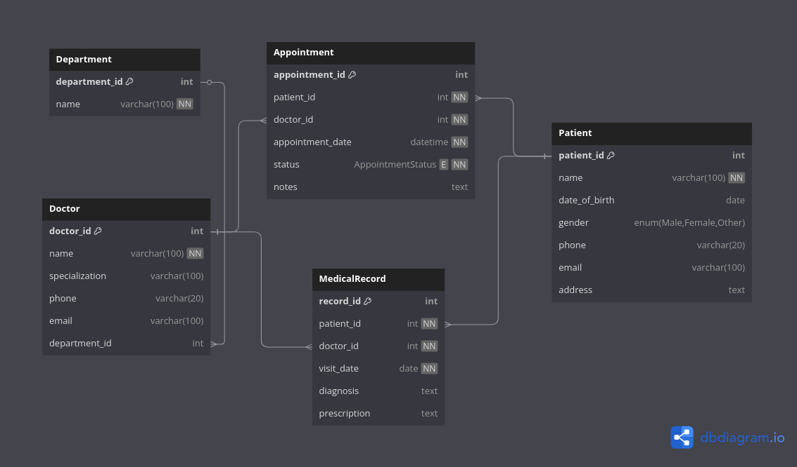

# 🏥 Clinic Booking System (MySQL)

A full-featured **Clinic Booking System** built using **MySQL**, designed to manage:

- Patient records
- Doctor profiles and departments
- Appointment scheduling
- Medical visit documentation

The database is normalized and includes structured relationships with appropriate constraints (PK, FK, NOT NULL, UNIQUE).

---

## 🗂️ Features

- ✅ Department & Doctor management
- ✅ Patient profiles with contact info
- ✅ Appointment scheduling (with status)
- ✅ Medical record keeping per visit
- ✅ Clean relational design (1-M and M-M relationships)
- ✅ Sample data for testing

---

## 🛠️ Technologies

- **Database**: MySQL
- **Modeling Tool**: DBML for ERD 
    
    
- **File Types**: `.sql`, `.dbml`

---

## 🧱 Database Schema

### Tables:

- `Department`: Medical departments (e.g., Cardiology)
- `Doctor`: Doctors and their specialties
- `Patient`: Patients with demographic data
- `Appointment`: Tracks bookings between patients and doctors
- `MedicalRecord`: Stores visit history, diagnosis, and prescriptions

---

## 🔄 Relationships

- One department → many doctors
- One doctor → many appointments & medical records
- One patient → many appointments & medical records
